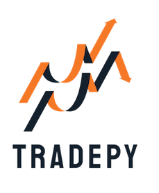

# TradePy

TradePy是一个面向证券交易的量化策略开发 + 实盘交易框架，实现了数据下载、策略回测、寻参优化以及实盘交易等量化交易全链路功能。🚧 **当前正在施工 V2 版本** 🚧，V1版请见 `legacy/v1`分支。新版本自底向上整体重写，在保留原功能的基础上:

- 🚀 全面替换Pandas为[Polars](https://pola.rs/), 大幅提升性能与优化内存占用
- 🚀 实现Polars友好的指标计算，预转译开平仓逻辑，核心链路高度向量化
  - 相较V1性能提升60-100倍
  - 4秒完成1000万根日K回测，包含指标计算、行情回放、策略执行、统计评估
- 📈 使用[Tushare](https://tushare.pro/)获取市场数据。近年来由于东财升级了反爬措施，已不适合使用Akshare作为主要获取手段
- 🛠️ 使用更现代化的开发工具链
- 💪 优化整体架构, 优化API设计, 全面加强类型安全
- 🤗 实现看板前端UI

> 🧑‍💻 古法编程为主, AI介入为辅, 不整虚的

**待办事项**:

- [x] 数据采集: 日K, 估值, 复权因子, 行业分类, 股票列表
- [x] 策略开发
- [x] 回测框架
- [ ] 策略评估
- [ ] 更新文档
- [ ] 实盘交易

**在线文档 (v1)**: [https://tradepy.lu-d.com](https://tradepy.lu-d.com)
