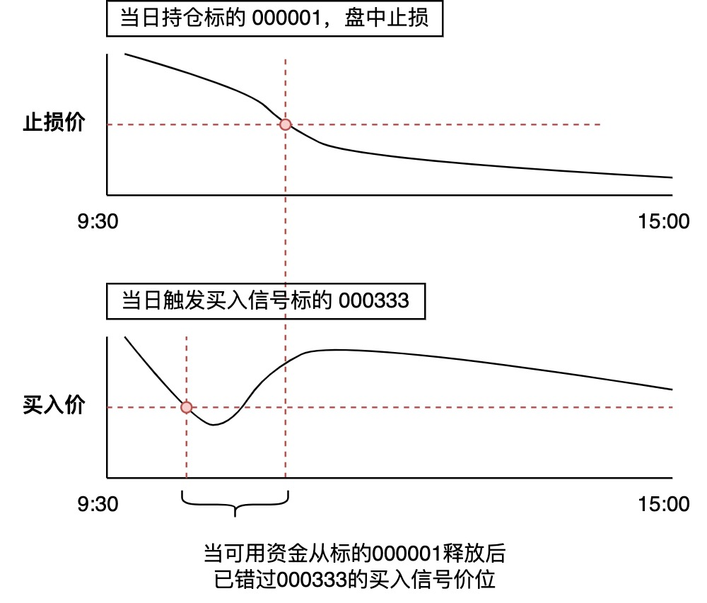

日内K线
==================

"偷价"困境
-------------------

在 `快速上手 </quickstart.html>`_ 教程中提示到，使用日K回测时，如果日内价格运行区间同时包含止盈和止损价，此时TradePy **无法判断止盈止损的发生顺序**，因此会默认止损优先。如果您设置的止损与止盈幅度较小，这个问题会尤其突出，甚至完全改变收益曲线。

另一个问题是， **如果您希望以日内价格买入**，比如"以开盘价计算当日60均线，价格回落到60均上方0.3%时买入"，用日K回测可能会发生"偷价"！让我们看一个简单例子:

- 假设某日开盘时全仓持股000001，在11:00触发止损
- 当日只有000333在10:00时，股价满足买入条件

此时，如果日K回测的实现逻辑是“先卖出，再买入”，则会在止损之后，再以000333在10:00时的价格买入。但实盘中000333在不一定再回归到10:00的价位，实际上当日是无法开新仓的。反之，如果是“先买入，再卖出”，但000333在尾盘时回归到了买入信号价，则会导致实际可开的仓位在回测时无法出现（因为执行卖出前没有可用资金）。此时无论怎样都会导致回测结果与实盘有较大出入。 **解决这些问题的办法之一，即是使用分钟级K线回测**。

下载并导出分钟级K线
-------------------

TradePy提供了一个命令行工具，使用方式如下:

.. code-block:: console

    >> python -m tradepy.cli.fetch_qmt_data --help

    usage: fetch_qmt_data.py [-h] --qmt QMT --out_dir OUT_DIR [--start_date START_DATE] [--until_date UNTIL_DATE] [--period {1m,5m}]

    步骤如下: 

    1. 下载QMT的分钟级K线数据;
    2. 导出每支个股的数据为pickle文件;
    3. 将同月份的个股数据合并, 导出为pickle文件.

    options:
    -h, --help            show this help message and exit
    --qmt QMT             QMT客户端安装目录, e.g., 'E:\国金证券QMT交易端'
    --out_dir OUT_DIR     Pickle文件的输出文件夹路径, e.g., 'E:\out'
    --start_date START_DATE
                            开始日期, e.g., '2020-01-01'
    --until_date UNTIL_DATE
                            结束日期, e.g., '2020-01-01'
    --period {1m,5m}      分钟级K线周期

**注意事项**

1. 运行之前需要先登录QMT终端，可选 独立行情 + 极简模式
2. 网络不稳定时，在步骤[1]可能会发生长时间停顿，此时可强制中断然后重新运行， ``fetch_qmt_data`` 会自动跳过已下载的数据

完成后，每个月的1分钟K线被保存至指定 ``out_dir`` 目录之下的 ``per_month`` 文件夹。请将该文件夹移动至您的TradePy本地数据库目录下（该目录地址见 ``~/.tradepy/config.yaml`` ），并重命名为 ``stocks-minutes``。

使用分钟级K线回测
-------------------

Voilà🎉! 然后运行回测时，将 ``BacktestConf.use_minute_k`` 设置为True即可，示例如下。为了避免不必要的计算，TradePy会先用日K数据筛选出当日会触发买入信号的个股，只加载可买入/卖出个股的分钟K线进行日内回测。

..  admonition:: 提示

    由于1分钟级数据量较大，回测会比用日K耗时很多。建议开发策略与寻参时使用日K，最后用分K评估最佳几组参数的实际预期收益。

.. code-block:: python

    conf = BacktestConf(
        cash_amount=1e6,
        use_minute_k=True,  # 默认是False
        strategy=StrategyConf(
            stop_loss=4.5,
            take_profit=5,
        )
    )

    df = StocksDailyBarsDepot.load()
    res, trade_book = MovingAverageCrossoverStrategy.backtest(df, conf)
