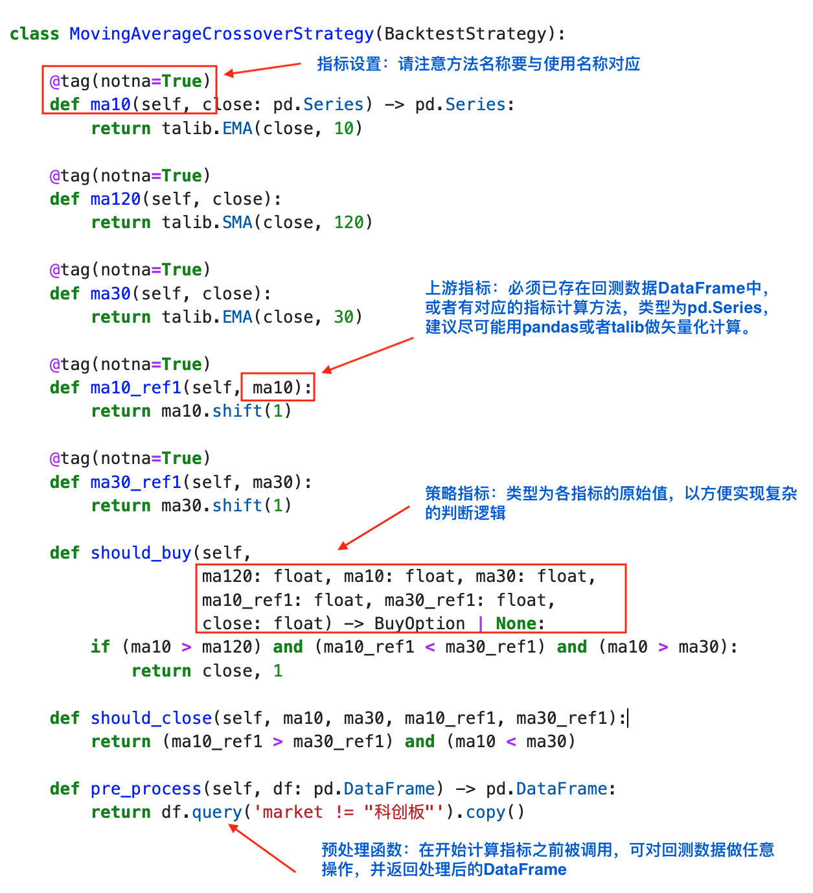

策略实现
==========

示例策略
--------------------

通常情况下，策略会有多个指标，且之间有较复杂的依赖关系，此时TradePy会通过指标函数的参数声明，推断出正确的指标计算顺序。因而，使用TradePy时，您只需关注指每个标计如何计算和以及判断买卖信号。

..  admonition:: 提示

    该示例代码可在 `快速上手 </quickstart.html>`_ 教程中找到。

单函数，多指标
--------------------

如果您的策略有很多计算方式雷同的指标（比如均线），那么每个均线指标单独写一个计算方法，或许显得有些冗余。TradePy提供了一种更简洁的写法，可以用单个函数计算多个指标。借此可以简化上述的实现:

.. code-block:: python

    class MovingAverageCrossoverStrategy(BacktestStrategy):

        # outputs: 输出指标的名称
        @tag(outputs=["ma10", "ma30", "ma120"], notna=True)
        def moving_averages(self, close):
            # 逐个返回指标结果，注意顺序要和outputs对应
            return talib.EMA(close, 10), talib.SMA(close, 30), talib.SMA(close, 120)

        @tag(outputs=["ma10_ref1", "ma30_ref1"], notna=True)
        def moving_averages_ref1(self, ma10, ma30) -> pd.Series:
            return ma10.shift(1), ma30.shift(1)

        def should_buy(self, sma120, ema10, sma30,
                    ema10_ref1, sma30_ref1, close, company) -> BuyOption | None:
            if "ST" not in company:
                if (ema10 > sma120) and (ema10_ref1 < sma30_ref1) and (ema10 > sma30):
                    return close, 1

        def should_sell(self, ema10, sma30, ema10_ref1, sma30_ref1):
            return (ema10_ref1 > sma30_ref1) and (ema10 < sma30)

        def pre_process(self, df: pd.DataFrame) -> pd.DataFrame:
            return df.query('market != "科创板"').copy()

内置指标
--------------------
5均、10均、20均、MACD之类的常用指标，也没有必要每个策略中都重复实现一遍。可以让策略类继承 ``FactorsMixin``，则可直接开始使用各类常用指标，具体可用指标请查阅 :ref:`FactorsMixin <factors-mixin>` 的实现。

现在，我们可以进一步简化策略的实现，只留下"前一日指标"部分的计算方法:

.. code-block:: python

    from tradepy.strategy.factors import FactorsMixin

    class MovingAverageCrossoverStrategy(BacktestStrategy, FactorsMixin):

        @tag(outputs=["ema10_ref1", "sma30_ref1"], notna=True)
        def moving_averages_ref1(self, ema10, sma30) -> pd.Series:
            return ema10.shift(1), sma30.shift(1)
        
        def should_buy(self, sma120, ema10, sma30,
                       ema10_ref1, sma30_ref1, close, company) -> BuyOption | None:
            if "ST" not in company:
                if (ema10 > sma120) and (ema10_ref1 < sma30_ref1) and (ema10 > sma30):
                    return close, 1

        def should_sell(self, ema10, sma30, ema10_ref1, sma30_ref1):
            return (ema10_ref1 > sma30_ref1) and (ema10 < sma30)

        def pre_process(self, df: pd.DataFrame) -> pd.DataFrame:
            return df.query('market != "科创板"').copy()

可调参数
--------------------

在开发策略时，一般无法最初就确定最佳的参数组合（比如均线类型、RSI周期、布林带周期、止损止盈点位），而需要反复回测以找到预期收益最大的一组参数。

TradePy支持通过 ``StrategyConf.custom_params`` 提供自定义参数，即可在策略类中直接在 ``self`` 上访问参数值。继续用同样的例子，我们可以再加一个策略逻辑“只买入股价在某个最低值以上的股票”: 

..  admonition:: 提示

    请参考"寻参优化"教程

.. code-block:: python

    from tradepy.strategy.factors import FactorsMixin
    from tradepy.core.conf import BacktestConf, StrategyConf

    class MovingAverageCrossoverStrategy(BacktestStrategy, FactorsMixin):

        # 其他不变 ...
    
        def should_buy(self, sma120, ema10, sma30, orig_open,
                       ema10_ref1, sma30_ref1, close, company) -> BuyOption | None:
            if "ST" not in company:
                # `orig_open`由TradePy提供，是未复权前的实际开盘价
                if orig_open >= self.min_stock_price:
                    if (ema10 > sma120) and (ema10_ref1 < sma30_ref1) and (ema10 > sma30):
                        return close, 1

    conf = BacktestConf(
        cash_amount=1e5,
        strategy=StrategyConf(
            stop_loss=4.5,
            take_profit=3,
            custom_params={
                # 自定义参数在这里
                "min_stock_price": 5
            }
        )
    )
    MovingAverageCrossoverStrategy.backtest(df, conf)

API
--------------------

.. _factors-mixin:

.. autoclass:: tradepy.strategy.factors.FactorsMixin
    :members:
