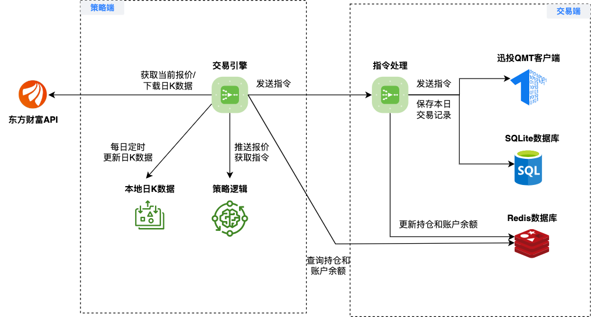

实盘交易
=============

TradePy的实盘交易系统由两个部分组成，适合用于中低频交易（数秒级/分钟级），完整架构见下图:

1. **策略端**: 策略端接收行情数据，并根据策略逻辑生成交易指令。
2. **交易端**: 交易端接收策略端的交易指令，并将其转发给miniQMT终端下单（暂不支持PTrade）。

.. warning::
    
    由于 `Celery <https://github.com/celery/celery>`_ 不支持 Windows，所以策略端必须部署在Linux/MacOS系统。而miniQMT终端则只支持Windows, 交易端则必须部署在Windows系统上。

..  admonition:: 最低系统配置

    - **策略端**: 推荐Debian12, 4G内存, 2核CPU，具体配置请根据策略指标的计算量而定。
    - **交易端**: Windows10, 4G内存, 2核CPU。

部署策略端
-------------

**安装Python环境**

1. 安装Miniconda:
   1.  ``wget https://repo.anaconda.com/miniconda/Miniconda3-py311_23.5.2-0-Linux-x86_64.sh``
   2.  ``bash Miniconda3-py311_23.5.2-0-Linux-x86_64.sh``
   3. 退出终端并重新登录
   4. 验证已成功安装conda，且默认环境的Python版本为3.11.4: ``python --version``
2. 安装TA-Lib: 参考此 `教程 <https://cloudstrata.io/install-ta-lib-on-ubuntu-server/>`_

**安装TradePy交易版**

注: 如果还没有安装git，先用 ``apt install -y git`` 安装。

.. parsed-literal::

   git clone --depth=1 https://github.com/namoshizun/TradePy.git
   cd TradePy
   pip install ".[bot]"

**配置TradePy**

运行 ``python -m tradepy.cli.bootstrap``，在输入"运行模式"时，建议输入"paper-trading"，然后先用模拟账户进行交易策略的测试。

部署交易端
-------------
TODO

TradePy配置
-------------
TODO

注意事项
-------------
TODO
