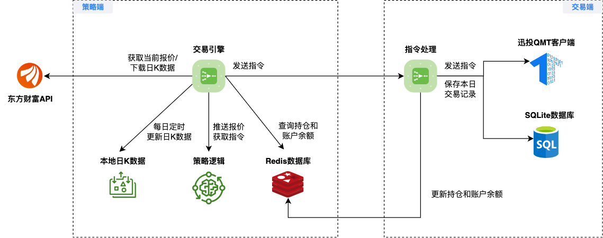

实盘交易
=============

系统架构
-------------

TradePy的实盘交易系统由两个部分组成，适合用于基于日K的中低频交易，完整架构见下图:

1. **策略端**:

   - 策略端接收行情数据，并根据策略逻辑生成交易指令。
   - 由于 `Celery <https://github.com/celery/celery>`_ 和Redis都不直接支持 Windows，所以策略端必须部署在Linux/MacOS系统

2. **交易端**:

   - 交易端接收策略端的交易指令，并将其转发给miniQMT终端下单（暂不支持PTrade）。
   - QMT终端则只支持Windows, 所以交易端则必须部署在Windows系统。

..  admonition:: 系统配置

    - **策略端**: Debian或Ubuntu, 4G内存, 2核CPU，具体配置请根据策略指标的计算量而定。
    - **交易端**: Windows10, 4G内存, 2核CPU。

..  admonition:: 防火墙规则

    - **策略端**: 需要开放Redis端口（默认6379）和Ping端口, 允许交易端的IP访问。
    - **交易端**: 需要开放交易HTTP服务端口（默认8000）和Ping端口, 允许策略端的IP访问。

下图详细说明了策略端交易引擎的每日工作流程，"相关参数"可在TradePy的config.yaml文件中编辑。需要特别说明的是， **TradePy不会在盘中交易阶段更新技术指标**，因而策略接收到的均线、MACD值等不会随盘中价格波动而变化。指标计算发生在两个阶段，且必须在3-5分钟内完成

- **盘前竞价2**: 使用开盘K线作为今日K线，合并历史数据后传给策略类的 ``compute_open_indicators`` 以计算当日指标。盘中只更新日K线报价，价格运行到买入/卖出信号价位的个股，则触发下单操作。

- **尾盘交易**: 使用14:54时的日K线合并历史数据后，传给策略类的 ``compute_close_indicators`` 以重计算当日指标。然后将结果提供给策略的 ``should_close`` 方法以获得需提前平仓的个股，并卖出这些个股。

部署策略端
-------------

**注**: 以下假定您的交易系统部署在云平台上，使用官方操作系统镜像。

安装Python
~~~~~~~~~~~~~~~~

1. 安装Miniconda:

   1.  ``wget https://repo.anaconda.com/miniconda/Miniconda3-py311_23.5.2-0-Linux-x86_64.sh``
   2.  ``bash Miniconda3-py311_23.5.2-0-Linux-x86_64.sh``
   3. 退出终端并重新登录
   4. 验证已成功安装conda，且默认环境的Python版本为3.11.4: ``python --version``

2. 安装TA-Lib: 参考此 `教程 <https://cloudstrata.io/install-ta-lib-on-ubuntu-server/>`_

安装Redis
~~~~~~~~~~~~~~~~

1. 请根据 `官方教程 <https://redis.io/docs/getting-started/installation/install-redis-on-linux/>`_ 安装Redis
2. 进入Redis终端: ``redis-cli``
3. 在终端内设置密码: ``config set requirepass TradePyRocks``, 这里示例密码为"TradePyRocks"
4. 在终端内设置允许通过内网访问: ``config set bind "127.0.0.1 -::1 10.0.12.17"``。

   - "10.0.12.17"是本示例中的策略端内网IP

安装TradePy交易版
~~~~~~~~~~~~~~~~~~~~

注: 如果还没有安装git，先用 ``apt install -y git`` 安装。

.. code-block:: console

   git clone https://github.com/namoshizun/TradePy.git
   cd TradePy
   pip install ".[bot]"

初始化
~~~~~~~~~~~~~~~~~~~~

运行 ``python -m tradepy.cli.bootstrap``，在输入"运行模式"时，建议输入"paper-trading"，然后先用模拟账户进行交易策略的测试。交易端服务地址是交易端服务器的内网IP。:

.. code-block:: console

   >> python -m tradepy.cli.bootstrap

   [TradePy初始化程序]
   > 请输入运行模式 (backtest=回测, paper-trading=模拟交易, live-trading=实盘交易) : paper-trading
   > 是否为交易端? (y/n): n
   > 请输入K线数据的下载目录（完整地址）: /root/database
   > 请输入Redis地址（默认localhost）: 
   > 请输入Redis端口（默认6379）: 
   > 请输入Redis密码: TradePyRocks
   > 请输入交易端服务地址: 10.0.8.15
   > 请输入交易端服务端口（默认8000）: 
    ~ 检查交易端服务地址是否可达 ...ok!
   👌 已创建配置文件: /root/.tradepy/config.yaml
   🚨 策略端的TradePy配置文件内，还需要手动填入您的交易策略的配置项

部署交易端
-----------------

安装Python环境
~~~~~~~~~~~~~~~~~~~~

下载官方版 `Python 3.11.4 <https://www.python.org/downloads/release/python-3114/>`_，安装时注意选择将Python添加到系统环境变量。

安装QMT以及XtQuant
~~~~~~~~~~~~~~~~~~~~

到官网下载 `XtQuant <http://docs.thinktrader.net/pages/633b48/>`_，解压后将xtquant文件夹移动到Python的本地库目录下，一般为: ``C:\Users\用户名\AppData\Local\Programs\Python\Python311\Lib\site-packages``。然后安装并登录QMT交易端，登录时注意选择"极简模式"

安装TradePy交易端
~~~~~~~~~~~~~~~~~~~~

注: 如果还没有安装git，请先下载Git Windows版。

.. parsed-literal::

   git clone https://github.com/namoshizun/TradePy.git
   cd TradePy
   pip install ".[broker]"

初始化
~~~~~~~~~~~~~~~~~~~~

注: Redis地址是策略端的内网IP。

.. code-block:: console

   >> python.exe -m tradepy.cli.bootstrap

   [TradePy初始化程序]
   > 请输入运行模式 (backtest=回测, paper-trading=模拟交易, live-trading=实盘交易) : paper-trading
   > 是否为交易端? (y/n): y
   > 请输入Redis地址（默认localhost）: 10.0.12.17
   > 请输入Redis端口（默认6379）: 
   > 请输入Redis密码: TradePyRocks
   > 请输入交易端服务地址: 10.0.8.15
   > 请输入交易端服务端口（默认8000）: 
    ~ 检查交易端服务地址是否可达 ...ok!
   > 请输入XtQuant Userdata_Mini目录（完整地址）: C:\国金QMT交易端模拟\userdata_mini
   > 请输入XtQuant账户ID: 00000001
   👌 已创建配置文件: C:\Users\Administrator\.tradepy\config.yaml

配置交易策略
-------------------------

接下来到 **策略端** 打开 ``~/.tradepy/config.yaml``，在以上步骤中TradePy已为您创建了这个文件，并填入了一些系统默认配置。 现在需要填入您的交易策略的具体配置（策略类导入名称、止损止盈、自定义参数等等），各配置项含义请参考 `配置文件说明 <configurations.html>`_ 。

需特别说明的是， ``trading.strategy.strategy_class`` 是策略类的导入名称，而不是策略类的文件名。例如，如果您的策略类文件名为 ``my_strategy.py``，且策略类名为 ``MyStrategy``，则此处应填入 ``my_strategy.MyStrategy``。 **必须保证策略类文件放在策略端启动时的当前工作目录，或在Python的本地库目录下**，否则将报导入模块错误！

.. warning::

   用于实盘交易的策略类，父类必须使用 ``tradepy.strategy.LiveStrategy``，不可使用 ``tradepy.strategy.BacktestStrategy``。

最后一步!
----------------------

部署完成后， **首次启动请选择某个交易日的盘后时间** （e.g., 16:00）。这样TradePy到晚些可自行下载历史日K，然后第二天早上正常开始执行交易流程。

首先启动交易端:

.. code-block:: console

   >> python.exe -m uvicorn tradepy.qmt_proxy.api_server:app --host 0.0.0.0

   INFO:     Started server process [6300]
   INFO:     Waiting for application startup.
   2023-08-31 11:04:01.704 | INFO     | tradepy.qmt_proxy.connector:connect:49 - 启动交易线程   

再启动策略端:

.. code-block:: console

   >> python -m tradepy.cli.autotrade

   celery beat v5.3.0 (emerald-rush) is starting.
   __    -    ... __   -        _
   LocalTime -> 2023-08-31 11:07:52
   Configuration ->
       . broker -> redis://:**@localhost:6379/0
       . loader -> celery.loaders.app.AppLoader
       . scheduler -> celery.beat.PersistentScheduler
       . db -> /tmp/beat-schedule
       . logfile -> [stderr]@%WARNING
       . maxinterval -> 5.00 minutes (300s)
    
    -------------- celery@DIs-MacBook-Pro-2.local v5.3.0 (emerald-rush)
   --- ***** ----- 
   -- ******* ---- macOS-10.15.7-x86_64-i386-64bit 2023-08-31 11:07:52
   - *** --- * --- 
   - ** ---------- [config]
   - ** ---------- .> app:         tradepy-tradebot:0x11fd2fd90
   - ** ---------- .> transport:   redis://:**@localhost:6379/0
   - ** ---------- .> results:     disabled://
   - *** --- * --- .> concurrency: 2 (prefork)
   -- ******* ---- .> task events: OFF (enable -E to monitor tasks in this worker)
   --- ***** ----- 
    -------------- [queues]
                   .> tradepy.tasks    exchange=celery(direct) key=celery

   [tasks]
     . tradepy.cancel_expired_orders
     . tradepy.fetch_market_quote
     . tradepy.flush_broker_cache
     . tradepy.handle_tick
     . tradepy.update_data_sources
     . tradepy.vacuum
     . tradepy.warm_database

